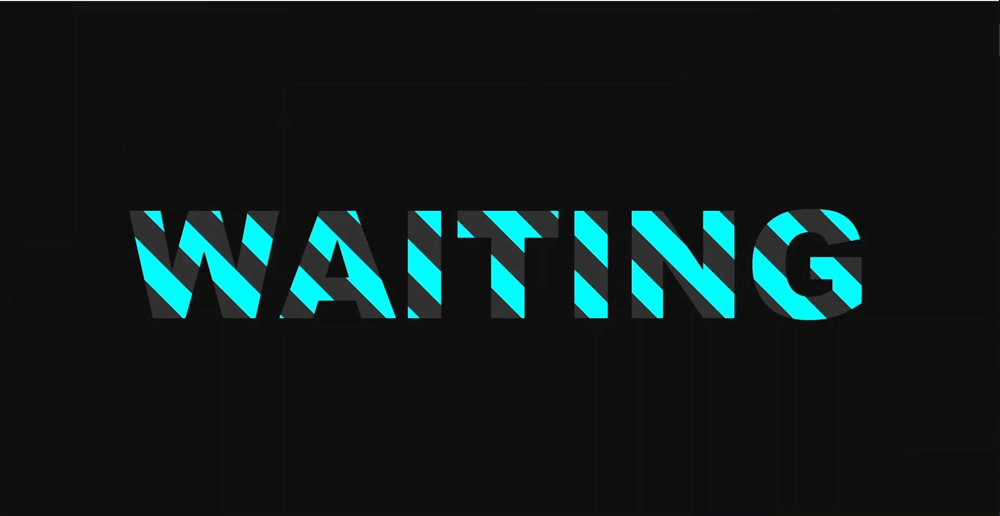
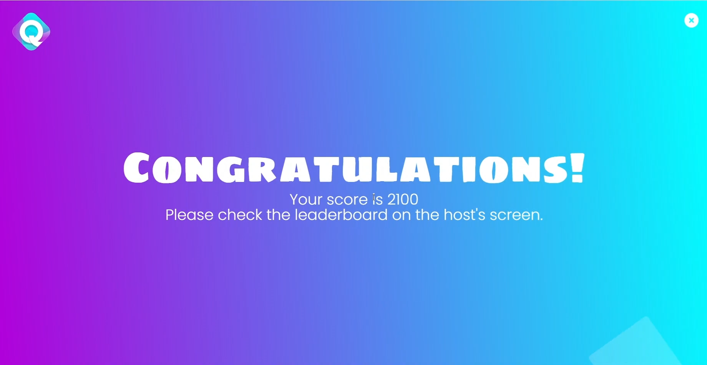

# About this project
A NodeJS Server for application called "Quizone" - my final-year's project.

# About Quizone
Quizone is a website allows users to host, and play a game with a quiz with some utilities.
## Demo
I researched so long but still can not find a way to deploy this server to the internet. The only available hosting platform I've found is Heroku,
but it's no longer completely free and requires a credit card to deploy, but unfortunately, I don't have it.

If you want to run this project, please clone it, then run `npm i`, and `npm start` to run.

Then you can go to this link to see the UI: https://quizzer-fe.vercel.app/. This is the UI created by my team member - Danh Tran.

You can see his GitHub project here: https://github.com/d4nhtr4n/quizone-fe.

This website will call API from the server you cloned and started at localhost.
## Notice
This project is using new language and technology to me. Some bugs need to fix,
and system performance is terrible, so just don't use it as a preference.

Maybe I will improve this project someday.

# Main functionalities:
## Host
- Users can create a quiz with various questions, with two types available: Multiple choice or True/False. They can also add a theme, thumbnail for the
quiz, and image for each question.
- Users can create a room that players can join using a PIN code. Host can also kick and block a player from joining the game, or mix the questions with
random orders.
- Users can see a report about the game that has finished. A report includes content of the question, max point, and answers of all players.
## Play
Users can join a game using a PIN code.

# Preview

## Host
### Manage Quiz
#### Creat, Edit A Question
**Features:** 
- Add question.
- Add thumbnail for questions.
- Choose `Question type` (Quiz or True/False).
- Choose `Reading Time` (Time to show the question but the answers).
- `Time Limit` (Time to show question and also its answers).
- Duplicate question.

- Select Theme.

- Change title

#### List Quizzes

**Features:** 
- Detail.

- Edit (Same UI as Create).
- Report.

### Host A Game
#### Host Screen

**Features:** Mix questions (in random order).
#### Waiting Screen

#### Showing Screen

#### Showing Result Screen
**Features:** Click next to go to next question.

#### Showing Final Result Screen

## Play
### Join A Game
**Validating Features:** 
- Can not use the same name.
- The player using an inappropriate name gets kicked by the host can not join the game again.
- Pin not found.
- Game pin is not valid.

### Waiting Screen

### Choosing Answer Screen

### Correct Screen

### Incorrect Screen

#### Showing Final Result Screen

